Daily nutrition is a fast test made for a nutrition company that allows the first communication between the user and the company in where the user is asked few questions that describe themselfs in achiving nutrition goals and the company send them a first view of what it would be like if they subscribe to their page and decide to take their services, this will help the company to make their future clients to know their brand and also generate a data base of users in benefit for future negotiations.

[Link to Daily Nutrition Test](https://juandavidc08.github.io/dailynutrition/)

---
## User Stories 

### First Time Visitor Goal
* As a first time visitor, I want to easily understand the concept of the page and easily follow up the steps to check whats the outcome.

### Second Time Visitor Goal
* As a second time visitor, I want to check up and remember what was my result and see again the nutrition plan they offer, also what the results would be for a different diet and decide to enter my email addresss for further information.

### Third Time Visitor 
* As a third time visitor, I want to share the page with someone who can be interested.

# Features

* A Favicon in the Browser.
  

* A title that act as a link to be able to return to Home Page.
  
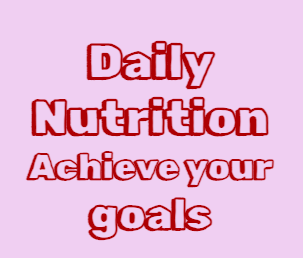

* A footer that take the users to all social media of the company.

---

### Home Page

* Emphasize in the company idea.
* Display the main idea of the test.
* Invites the user to follow the steps.

### Test Page

* When the users enter their name allows to begin the questions and as an answer is clicked the follow question appears.

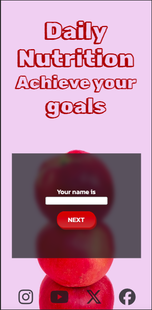 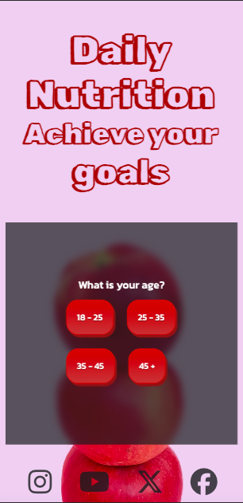 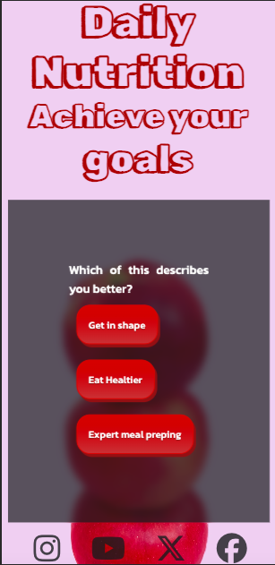 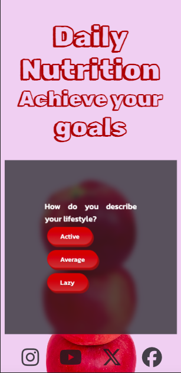 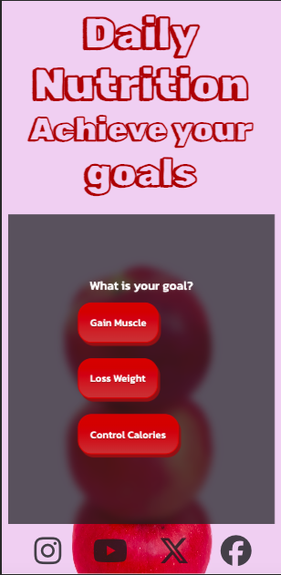 

---

### Result Pages

* After all question are answered the page is redirect to the result page depending on their objective, there are 3 main result pages, Gain Muscle, Loss Weight, Control Calories, all of them are structure with the title thats work as a link to main page, a modal button that shows a nutrition plan and a form so the user can contact the company.

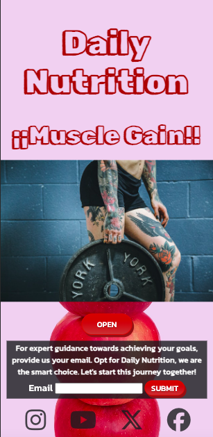 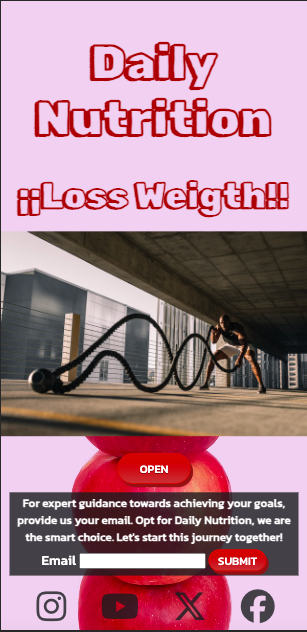 

* The modal works when the user click on the open button full nutrition plan is display, it also have a close button under it to return to the result page.

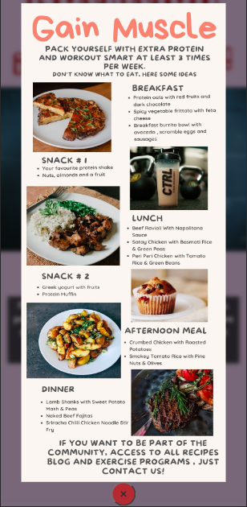
  
* Under the modal there is a email form that users should submit if they want further information

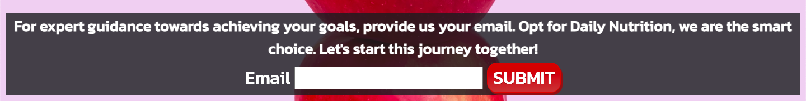

* The email form have a function in where the user need to complete it with a valid emai if not it doesnt send the information.

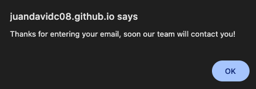 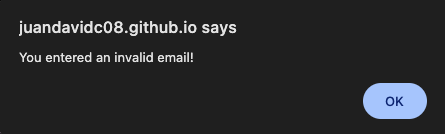