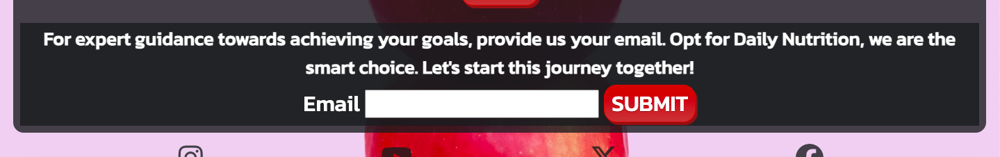

Daily nutrition is a fast test made for a nutrition company that allows the first communication between the user and the company in where the user is asked few questions that describe themselfs in achiving nutrition goals and the company send them a first view of what it would be like if they subscribe to their page and decide to take their services, this will help the company to make their future clients to know their brand and also generate a data base of users in benefit for future negotiations.

[Link to Daily Nutrition Test](https://juandavidc08.github.io/dailynutrition/)

---
## User Stories 

### First Time Visitor Goal
* As a first time visitor, I want to easily understand the concept of the page and easily follow up the steps to check whats the outcome.

### Second Time Visitor Goal
* As a second time visitor, I want to check up and remember what was my result and see again the nutrition plan they offer, also what the results would be for a different diet and decide to enter my email addresss for further information.

### Third Time Visitor 
* As a third time visitor, I want to share the page with someone who can be interested.

# Features

* A Favicon in the Browser.
  

* A title that act as a link to be able to return to Home Page.
  

* A footer that take the users to all social media of the company.

---

### Home Page

* Emphasize in the company idea.
* Display the main idea of the test.
* Invites the user to follow the steps.

### Test Page

* When the users enter their name allows to begin the questions and as an answer is clicked the follow question appears. Here are shown all the questions in order.

* Test Main Page:
 
* If the user does not place a name it will show an alert

* First question:
 
* Second question:

* Third question:
 
* Fourth question: 
 

---

### Result Pages

* After all question are answered the page is redirect to the result page depending on their objective, there are 3 main result pages, Gain Muscle, Loss Weight, Control Calories, all of them are structure with the title thats work as a link to main page, a modal button that shows a nutrition plan and a form so the user can contact the company.

 
 

* The modal works when the user click on the open button full nutrition plan is display, it also have a close button under it to return to the result page.
* Each resut page have a diferent image modal that shows an specific Meal plan.

* GAIN MUSCLE MEAL PREP

* LOSS WEIGHT MEAL PREP

* CONTROL CALORIES MEAL PREP

  
* Under the modal there is a email form that users should submit if they want further information

* The email form have a function in where the user need to complete it with a valid emai if not it doesnt send the information.

 

---

## Design

* The concept of Daily nutrition is a minimalist image with contemporary aspects with a target market of fitness related users, with their image they want also to attract a customer data base of regular persons that desire to achieve a healthier lifestyle.

### Color Scheme

### Fonts

### Wireframe

* I used [Wireframe](https://wireframe.cc/) to skecth the idea of the each page

---

## Testing

Please refer to the [TESTING.md](TESTING.md) file for all test-related documentation.

---

## Bugs

* No bugs found.

---

## Technologies Used

- [HTML](https://developer.mozilla.org/en-US/docs/Web/HTML): Foundation.
- [CSS](https://developer.mozilla.org/en-US/docs/Web/CSS): Style and layout.
- [JavaScript](https://developer.mozilla.org/es/docs/Web/JavaScript): User interaction in the web page.
- [Github](https://github.com): Host and deploy the code for the website.
- [Codeanywhere](https://app.codeanywhere.com): Write and edit the code.
- [Wireframe](https://wireframe.cc/): Sketch the basic of the idea.
- [Coolors.co](https://coolors.co/): Create Pallete.
- [Favicon.io](https://favicon.io/) To create favicon.
- [Google Developer Tools](https://developers.google.com/web/tools) To troubleshoot and test features.
- [Google Fonts](https://fonts.google.com/) - To import the fonts used on the website.
- [Sweet Alert](https://sweetalert2.github.io/#themes) - Custom alerts.
  
---

## Deployment

* The project was deployed to GitHub pages.
* The link can be found [here](https://juandavidc08.github.io/dailynutrition/)
* Go to the Settings tab of the GitHub repo.
* On the left-hand sidebar, in the Code and automation section, select Pages.
* Source should be'Deploy from Branch'.
* Select Main branch.
* Set folder to root.
* Save

---

### Future Implementation

* Create more visual questions, in where the user can interact when deciding giving them more range of exactitude to target the result more specific manner.
* Implement a Daily nutrition video of the founders explaining why is his about and what is their mission in the home page
* Add custome 404 page.
* Improve the quality of the commits that were used.
* Improve accessibility.
* Improve best practices in lighthouse.

---

## Credits

### Code Used

* For creating the modal I used [this youtube video](https://www.youtube.com/watch?v=XH5OW46yO8I) to understand the function better beside [this page](https://www.freecodecamp.org/news/how-to-build-a-modal-with-javascript/).
* For emai validator I used [this link](https://www.scaler.com/topics/email-validation-in-javascript/) to fully understan and place the correct function in the page.
* For custom alerts I used [Sweet Alert](https://sweetalert2.github.io/#themes)

### Media

* All images where taken from [Unsplash](https://unsplash.com/es)

* The favicon image was taken from [favicon](https://favicon.io/)

* Icons animated and no animated where taken from [FontAwesome] (https://fontawesome.com/)

* Responsive image photo was took from [ui](https://ui.dev/amiresponsive)

### Acknowledgments

I would like to acknowledge the following people:

* Jubril Akolade - My Code Institue Mentor.

* Code Institute tutors and community that help me.
