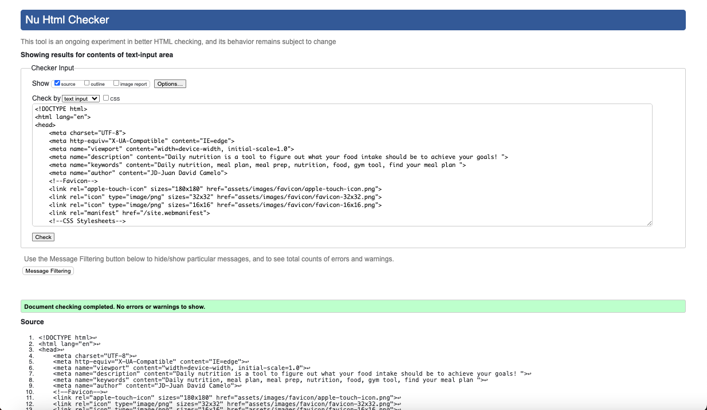
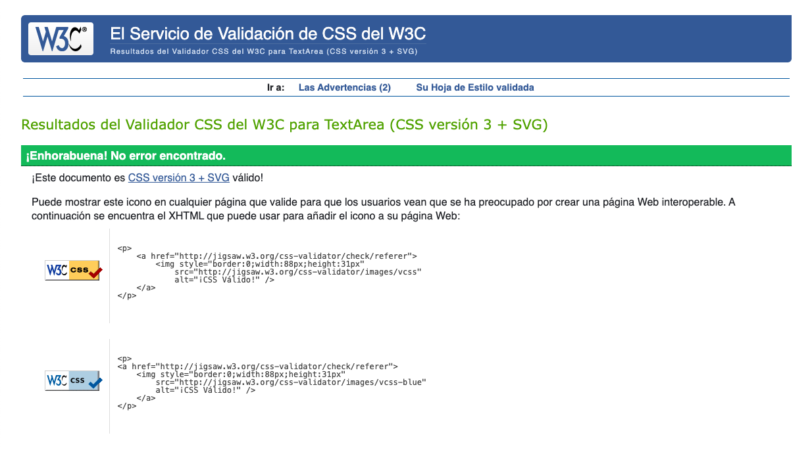
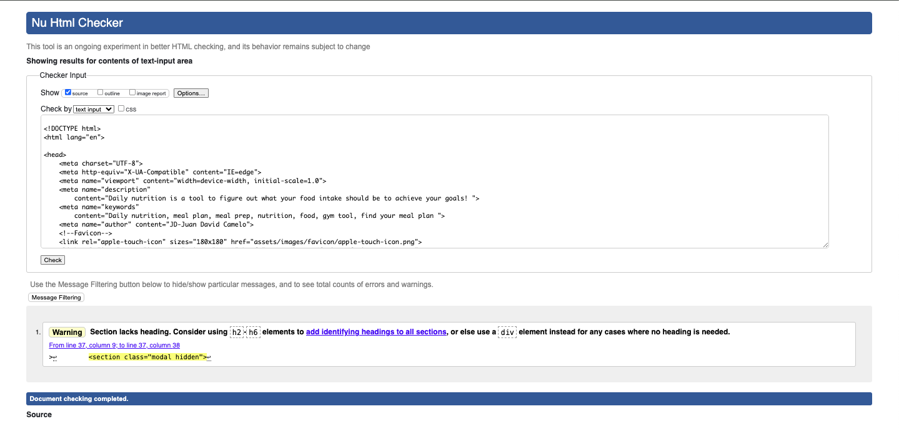
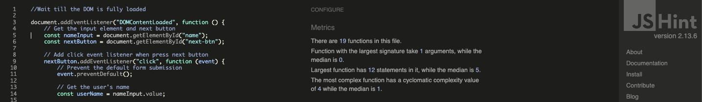

# Daily Nutition - Testing

Here is the link for the deployed website: [Daily Nutrition](https://juandavidc08.github.io/dailynutrition/)

I successfully navigated through the entire project, and there were numerous changes made from the beginning to the end result. Throughout the process, I primarily utilized Google DevTools to enhance the appearance of the page. I conducted thorough page by page to ensure everything was correct.

## Automated Testing

* HTML and CSS
  Both technologies where validated with: [W3C](https://validator.w3.org/)
  
 
No errors neither on home page or test page.
 
No errors.

No errors. 1 warning in section where the modal will appear.

* JavaScript
  For JavaScript was validated with: [jshint](https://jshint.com/) 
 Passed.

---

## Lighthouse

Home Page
Test Page
Resut Page

---

## Manual Testing

* To confirm page was successfully functioning was teste in 3 diferent browsers: Chrome, Safari and Mozilla Firefox.

* Checklist table for manua testing

#### Home Page

| feature | action | expected result | tested | passed | comments |
| --- | --- | --- | --- | --- | --- |
| Home | Click on the Title "Daily Nutrition" link | The user is redirected to the main page | Yes | Yes | - |
| Lets begin button | Click on the Button | The user is redirected to the test page | Yes | Yes | - |
| Footer | | | | | |
| Instagram icon in the footer | Click on the Instagram icon | The user is redirected to the Instagram page | Yes | Yes | - |
| Twitter icon in the footer | Click on the Twitter icon | The user is redirected to the Twitter page | Yes | Yes | - |
| YouTube icon in the footer | Click on the YouTube icon | The user is redirected to the YouTube page | Yes | Yes | - |

#### Test Page

| feature | action | expected result | tested | passed | comments |
| --- | --- | --- | --- | --- | --- |
| Home | Click on the Title "Daily Nutrition" link | The user is redirected to the main page | Yes | Yes | - |
| Next button | Click on the Button | The user is redirected to the next question page | Yes | Yes | - |
| First name input | Enter the first name | The first name is entered | Yes | Yes | If user doesn't enter the first name, the error message appears |
| Test Buttons | Cick on diferent options| the user is redirected to next question | Yes | Yes | All buttons are working correctly at the end of the test it is redirect to result page|
| Footer | | | | | |
| Instagram icon in the footer | Click on the Instagram icon | The user is redirected to the Instagram page | Yes | Yes | - |
| Twitter icon in the footer | Click on the Twitter icon | The user is redirected to the Twitter page | Yes | Yes | - |
| YouTube icon in the footer | Click on the YouTube icon | The user is redirected to the YouTube page | Yes | Yes | - |

### Result Page

| feature | action | expected result | tested | passed | comments |
| --- | --- | --- | --- | --- | --- |
| Home | Click on the Title "Daily Nutrition" link | The user is redirected to the main page | Yes | Yes | - |
| Open button | Click on the Button | The user open the Modal | Yes | Yes | - |
| Email input | Enter the email | The email is entered | Yes | Yes | If user doesn't enter the email, the error message appears. If user enters not valid email, the error message appears |
| Footer | | | | | |
| Instagram icon in the footer | Click on the Instagram icon | The user is redirected to the Instagram page | Yes | Yes | - |
| Twitter icon in the footer | Click on the Twitter icon | The user is redirected to the Twitter page | Yes | Yes | - |
| YouTube icon in the footer | Click on the YouTube icon | The user is redirected to the YouTube page | Yes | Yes | - |